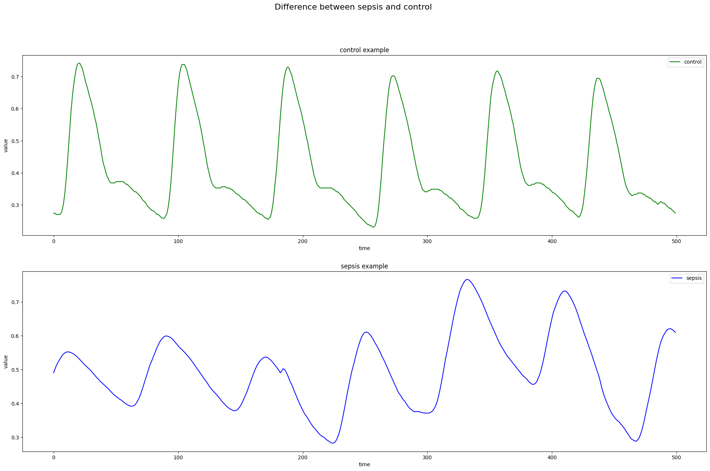
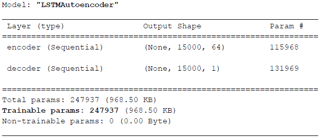
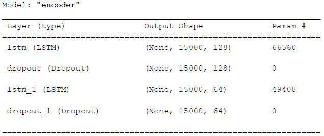
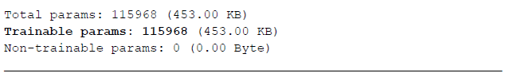
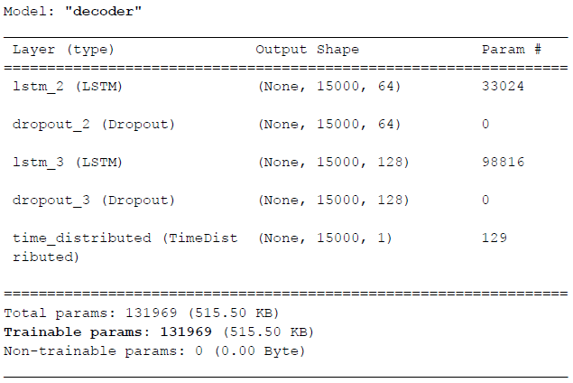

# Autoencoder LSTM per Anomaly Detection su Serie Temporali (segnali PPG riguardanti la Sepsi) 
# Sviluppato tramite Python e la libreria Keras/Tensorflow
## Progetto di Machine Learning a.a. 2022/2023
Autoencoder formato da alcuni layer LSTM per un task di anomaly detection su serie temporali derivanti da acquisizione di segnali PPG al fine del riconoscimento preventivo della malattia Sepsi.

## La Sepsi
La Sepsi o setticemia è una sindrome clinica che si verifica come rara complicazione di un’infezione. La sepsi è una condizione potenzialmente molto grave, che passa attraverso stadi di gravità crescente e come tale necessita di un immediato trattamento medico, senza una cura tempestiva infatti, può risultare in una malattia mortale. \
L’obiettivo del progetto è quindi quello di sfruttare le tecniche di Machine Learning attuali per creare un modello che, ricevendo in input segnali fotopletismografici (PPG), riesca a riconoscere, quanto prima, l’avvento di questa malattia.

## Dataset utilizzato: Mimic III Vaweform Database Matched Subset
Per questo progetto sono stati utilizzati i dati presenti nel MIMIC-III Waveform Database Matched Subset, una versione ridotta del dataset MIMIC-III Waveform Database, nel quale sono presenti 22137 record di segnali fisiologici e 22247 record numerici discreti da 10282 pazienti in terapia intensiva.\
In questo progetto nello specifico sono stati utilizzati dati pre-processati da alcuni colleghi. Al dataset originale sono quindi state eliminate alcune istanze caratterizzate dall’assenza di dati (presumibilmente movimenti o perdita del sensore da parte del paziente) e applicate tecniche di correzione per ridurre l’impatto della presenza di rumore nei dati stessi. Successivamente i dati sono stati preventivamente suddivisi in training (70%), validation (10%) e test set (20%), in ognuno dei quali sono presenti i due gruppi di segnali, sepsis e control. 

    

 
Le finestre temporali presenti nei vari sotto-dataset sono anche raggruppate per paziente, ovvero ogni paziente presente in uno di essi avrà circa 30 finestre temporali (di lunghezza 15.000 = 120 sec x 125 Hz) associate. In questo modo sarà
possibile anche valutare performance su quanti pazienti sono stati riconosciuti correttamente come malati/sani e non solo sulle singole finestre temporali.

## Task di Anomaly Detection 
Per affrontare il task in questione è stato sviluppato un modello Autoencoder formato da layer LSTM per effettuare tecniche di Anomaly Detection. \
Questo modello verrà addestrato sui dati di controllo per imparare a riprodurre fedelmente tali segnali. Questo si traduce nel fatto che si cercherà di minimizzare la differenza dei valori delle funzioni di loss tra le istanze dei dati reali e le corrispondenti
predizioni che il modello ha fornito in output per tali segnali. In questo modo il modello dovrebbe essere in grado di riprodurre perfettamente i segnali di  controllo, mentre dovrebbe produrre in output segnali poco coerenti con i corrispettivi valori forniti in input nel caso in cui gli si proponessero segnali diversi, come ad esempio quelli di sepsi. In questo caso ci si aspetta infatti che la differenza tra le loss di reali finestre temporali di sepsi e quelle delle rispettive predizioni sia più alta rispetto ai segnali di controllo. \
Grazie a ciò si può impostare una soglia attraverso la quale effettuare una classificazione della tipologia del segnale. Se infatti, fornita in input al modello una finestra temporale di un segnale PPG di un paziente, la differenza tra la loss del segnale reale e di quello riprodotto (fornito in output dal modello) è inferiore alla soglia impostata, tale istanza verrà categorizzata come “di controllo”. In caso contrario, ovvero se la differenza delle loss è superiore alla soglia impostata, il segnale verrà categorizzato come “sepsi”.

## Tecnologie Utilizzate
Per sviluppare il progetto è stato utilizzato Python come linguaggio di programmazione. Per importare il dataset ed effettuare le operazioni di preprocessing sono state utilizzate le librerie NumPy e scikit-learn. Il modello è stato creato invece con metodi e classi di Keras e Tensorflow. \
La maggior parte delle metriche di valutazione sono state implementate manualmente seguendo la loro definizione matematica. Matplotlib e scikit-learn sono infine state utilizzate per creare tutti i grafici relativi ai segnali, tutti i grafici relativi alle varie fasi di addestramento e di illustrazione delle varie performance del modello (come ad esempio le varie distribuzioni dei valori di loss ottenuti sui vari dataset) e le matrici di confusione.

## Modello Autoencoder
Il modello Autoencoder utilizzato è illustrato nella figura sottostante. 

    

 
Di cui si riportano sotto anche la composizione di Encoder e Decoder.

    

    

 

    

 

## Scelte degli iperparametri
Dopo alcune prove gli iperparametri di addestramento selezionati sono i seguenti. \
BATCH_SIZE = 64 \
EPOCHS = 50 \
VALIDATION_SPLIT = 0.2 \
LOSS_FUNCTION = "mse" \
EarlyStopping(monitor="val_loss", patience=5, mode="min") 

## Ulteriori informazioni 
Questa pagina è stata creata principalmente per esporre le caratteristiche di un possibile modello Autoencoder formato da layer LSTM che può essere utilizzato per anomaly detection su serie temporali. \
Nel caso si voglia approfondire su questo progetto nello specifico è possibile visionare il [codice sorgente](LSTMAutoencoder.ipynb) utilizzato oppure leggere la [relazione](./Relazione%20ML%20Taverna%20Luca.pdf) scritta per la presentazione del progetto ultimato.
